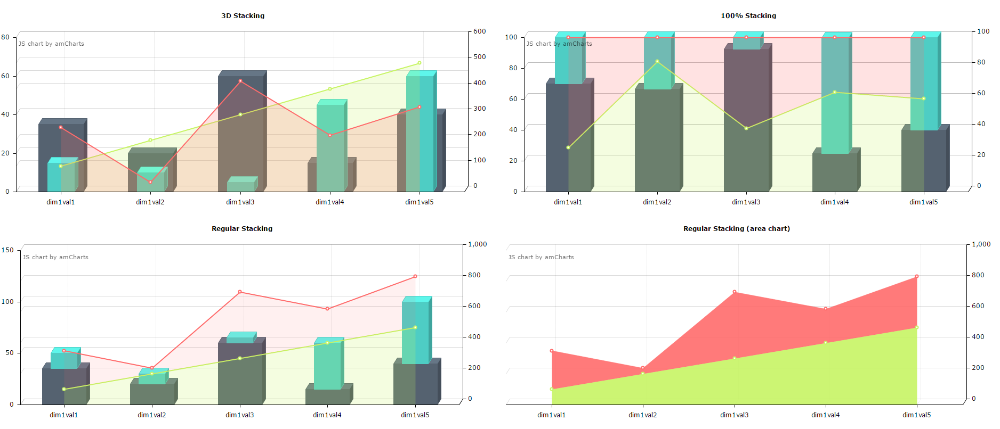

# Qliksense Extension integrating amCharts.

## Introduction
This is a work in progress project for integrating [amCharts](https://www.amcharts.com/) charting library into qliksense extension(s).

At the moment the project is an implementation of a waterfall chart in the amWaterfall folder and a combo chart in the amCombo folder.

Please rate & give feedback! If you wan't to contribute feel free to message me on github.

### Latest 5 Changes
* Changed the properties structrue & optimized code. The structure and naming of properties should closely mimic the amCharts object structure, making it possible to use the amCharts documentation when both trying to understand the interface and the code. See below in the amCombo documentation section.
* Add dashing of measure lines functionality (see screenshots below).
* Added setting to prefix large numbers automatically.
* Added line bullet settings to change size color and type of bullet. Also allowed lines to have a thickness of 0, effectively allowing line types to work as a scatterplot with only bullets showing.
* Added setting to select stacking type of an axis (stacks measure of similar type reffering to the same axis: 3d/regular/none/100%).

## Screenshots
### Combo Chart
The goal of the combo chart is to give the user alooot of settings to mess around with, the below examples are just a small subset of outcomes you can produce.

### Combo chart (silly visualizations)

### Combo Chart (New measure Opacity)

### Combo Chart (New stacking settings)

### Waterfall Chart

## How to use
Import amCombo.zip & amWaterfall.zip into your qliksense dev-hub extensions folder.

I've included some default 'synthetic' dimensions and expressions that should help you understand how dimensions and measures are used in the chart. If you don't know how the valuelist & pick & match functions work, especially in relation to synthetic dimensions there is a post [here](https://community.qlik.com/blogs/qlikviewdesignblog/2013/07/01/valuelist-for-those-tricky-situations) by Alexander Karlsson explaining valuelist together with an IF statement.

The pick(match()) structure does the same thing as the if sentence in this case. Where instead of having
case1 = statement1, return mes1..
case2 = statement2, return mes2.
The structure is more
case1,case2,..statement1,statement2..mes1,mes2...

## Documentation
When using the amCombo chart the naming and structure follows that of the amCharts API.
* The additional properties on the measures are a subset of the API properties [amGraph](https://docs.amcharts.com/3/javascriptcharts/AmGraph).
* The properties in the amCharts section are a subset of the API properties of the [amSerialChart](https://docs.amcharts.com/3/javascriptcharts/AmSerialChart) and its descendant objects (valueAxes, legend, titles & categoryAxis).

## Known issues
* The axis rotation API settings doesn't seem to work if you rotate the whole graph via the rotate graph setting.

## Disclaimer
I'm in no way affiliated with amcharts.com. Their library is free to use for commercial purposes with the caveate that you must include the link to their website in the charts (as seen on the top left of the chart screenshots). If you would want a version without links to amcharts.com they would have to implement a solution to market.qlik.