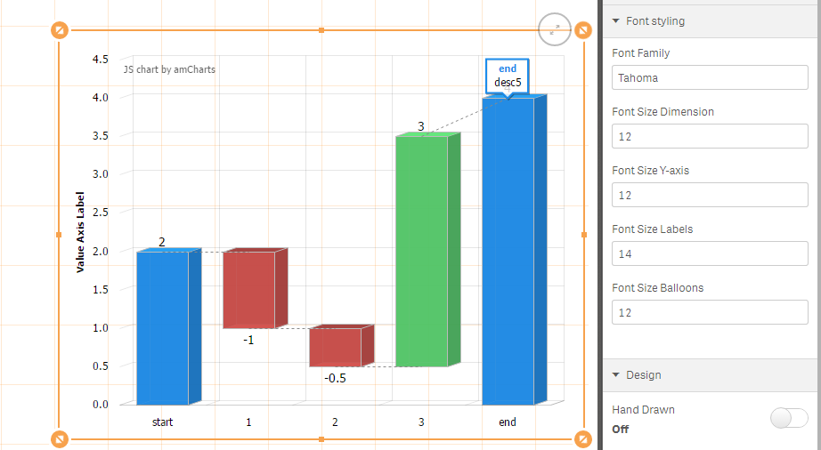
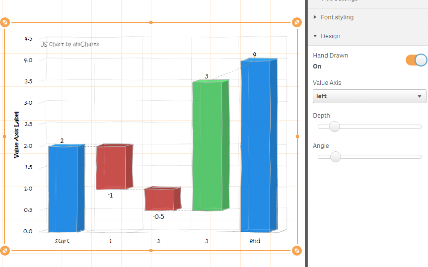

# Qliksense Extension integrating amCharts.

## Introduction
This project is a work in progress qliksense visual extension, for integrating the
[amCharts](https://www.amcharts.com/) charting library.
At the moment the project is an implementation of a waterfall chart in the amWaterfall folder and a work in progress bullet / line combo chart in the amCombo folder.

### Latest Change
* The combo chart now works with changing measure expressions & settings.

### Next Change
* Try out type setting for bar charts: 'stacked' & 'clustered'.
* Hide bar settings from line type and visa versa.
* Implement the appearance section properties on the combo chart.

## Screenshots
### Standard Look

### Title Settings

### 3D Effects

### Font Styling

### Hand Drawn Effects

### WIP - Bullet / line combo chart.

## How to use
At the moment, transfer the amWaterfall.js, amWaterfall.qext, wbFolder.wbl files to your extension folder.

I've included some default 'synthetic' dimensions and expressions that should help you understand how dimensions and measures are used in the chart. If you don't know how the valuelist & pick & match functions work, especially in relation to synthetic dimensions there is a post [here](https://community.qlik.com/blogs/qlikviewdesignblog/2013/07/01/valuelist-for-those-tricky-situations) by Alexander Karlsson explaining valuelist together with an IF statement. The pick(match()) structure does the same thing as the if sentence in this case. Where instead of having case1 = statement1, return mes1.. case2 = statement2, return mes2. The structure is more case1,case2,..statement1,statement2..mes1,mes2...

## Known issues
* The axis rotation API settings doesn't seem to work if you rotate the whole graph via the rotate graph setting.