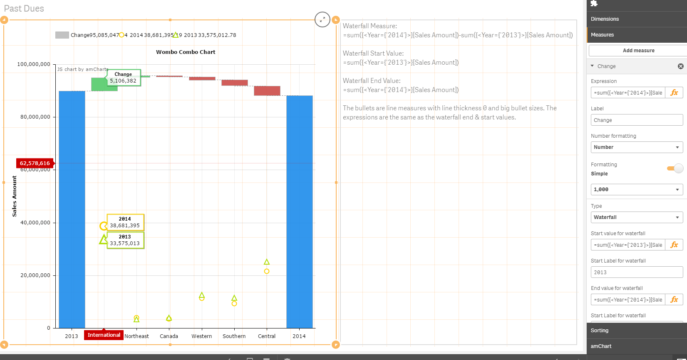
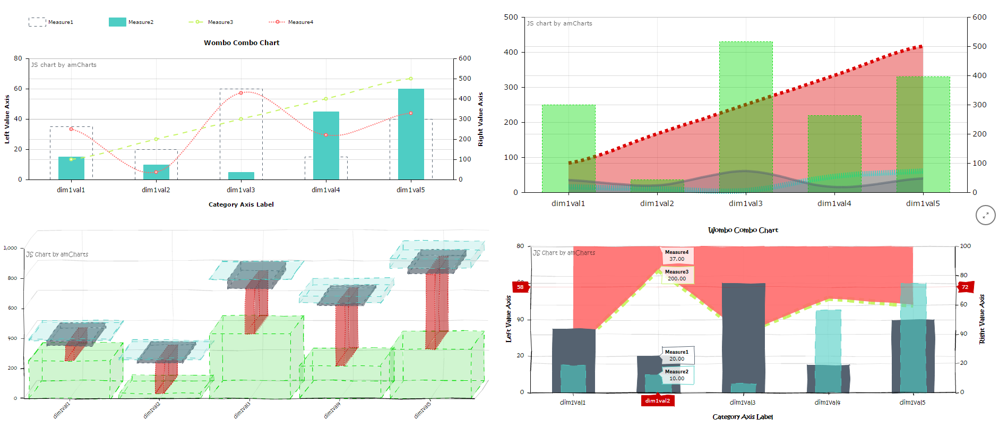

# Qliksense Extension integrating amCharts.

## Introduction
This is a work in progress project for integrating [amCharts](https://www.amcharts.com/) charting library into qliksense extension(s).

At the moment this project is an implementation of a combo chart that includes a waterfall type measure.

Please rate & give feedback! If you wan't to contribute feel free to message me on github.

### Latest 5 Changes
* When you choose the waterfall measure type, you are now prompted to enter an expression for start and end values. See screenshot below regarding how to use this setup. THe reason for this change was to avoid having to use complex valuelist synthetic dimensions to be able to create a waterfall.
* Changed the chart to use the standard numberformatting settings on the measures instead. (These will be reflected on labels and balloons however they wont be reflected in the value axis which can be a minor problem for % graphs where the actual numbers are different:*100, also with this setup you can't change the labeltext and balloon text but only select wether to show them or not.). This also fixes an issue with the waterfall type measure; before label numbers were accumulative, now they represent the single observation value.
* Changed the refference to the amCharts library to be local instead of CDN.
* Instead of having the waterfall chart in a seperate extension, you can now choose 'Waterfall' as the measure type next to (column/line/smoothedLine).
* Added various settings including number formatting on a chart level (thats how it is in amCharts). Changed dimension to display its text property to correctly display e.g. dates. Made the chart clickable which makes it select in the app dimensions (thanks to Simon Haughbølle for that code). I also removed the initial dimensions and measures that were being parsed on initiation as i felt like they were being more annoying than helpfull, when you actually had to use the charts and not develop them.

## Screenshots
### Combo Chart
The goal of the combo chart is to give the user alooot of settings to mess around with, the below examples are just a small subset of outcomes you can produce.
### New method for creating waterfall's in the combo chart.

### Combo chart (waterfall measure type)

### Random settings screens.

### Combo chart (silly visualizations)

### Combo Chart (New measure Opacity)

### Combo Chart (New stacking settings)

## How to use
Import amCombo.zip into your qliksense dev-hub extensions folder.

## Documentation
When using the amCombo chart the naming and structure follows that of the amCharts API.
* The additional properties on the measures are a subset of the API properties [amGraph](https://docs.amcharts.com/3/javascriptcharts/AmGraph).
* The properties in the amCharts section are a subset of the API properties of the [amSerialChart](https://docs.amcharts.com/3/javascriptcharts/AmSerialChart) and its descendant objects (valueAxes, legend, titles & categoryAxis).

## Disclaimer
I'm in no way affiliated with amcharts.com. Their library is free to use for commercial purposes with the caveate that you must include the link to their website in the charts (as seen on the top left of the chart screenshots). If you would want a version without links to amcharts.com they would have to implement a solution to market.qlik.